# 📊 LicitaFlow - Diagramas Visuais

> **Representações Visuais da Arquitetura**  
> Versão: 1.0  
> Data: 28 de Outubro de 2025

---

## 📑 Índice

1. [Diagrama de Contexto do Sistema](#1-diagrama-de-contexto-do-sistema)
2. [Arquitetura de Componentes (Frontend)](#2-arquitetura-de-componentes-frontend)
3. [Vertical Slice Architecture (Backend)](#3-vertical-slice-architecture-backend)
4. [Fluxo de Dados](#4-fluxo-de-dados)
5. [Schema do Banco de Dados (ER Diagram)](#5-schema-do-banco-de-dados-er-diagram)
6. [Fluxo de Autenticação](#6-fluxo-de-autenticação)
7. [Fluxo de OCR de Editais](#7-fluxo-de-ocr-de-editais)
8. [Pipeline de Deployment](#8-pipeline-de-deployment)
9. [Roadmap de Desenvolvimento](#9-roadmap-de-desenvolvimento)

---

## 1. Diagrama de Contexto do Sistema

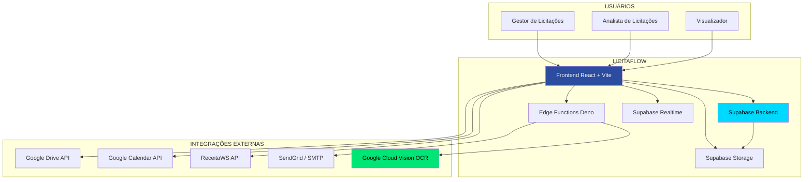

---

## 2. Arquitetura de Componentes (Frontend)

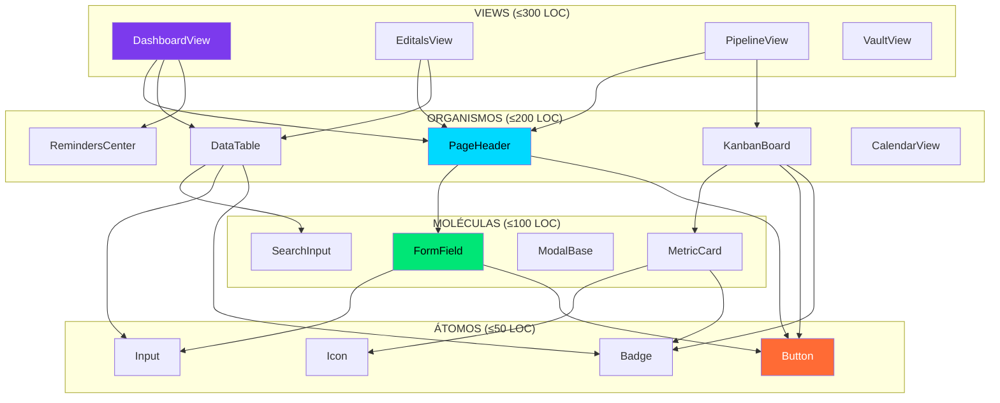

---

## 3. Vertical Slice Architecture (Backend)

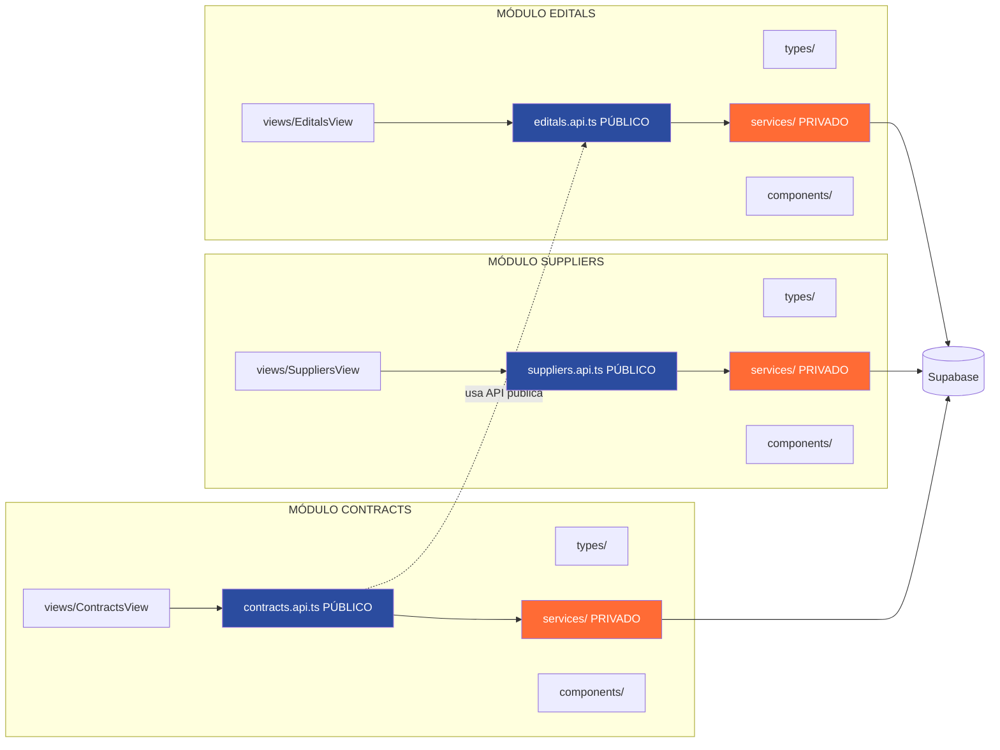

**Legenda:**
- 🔵 Azul = API Pública (pode ser acessada)
- 🔴 Vermelho = Service Privado (NÃO pode ser acessado)
- Linha tracejada = Comunicação entre módulos (via API)

---

## 4. Fluxo de Dados

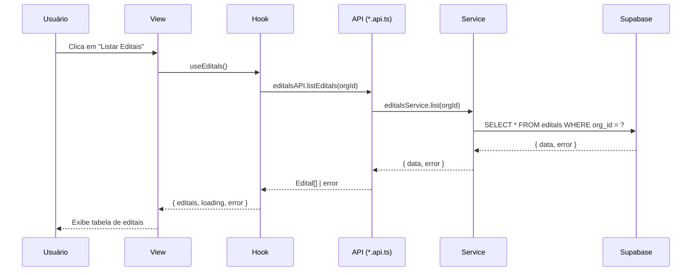

---

## 5. Schema do Banco de Dados (ER Diagram)

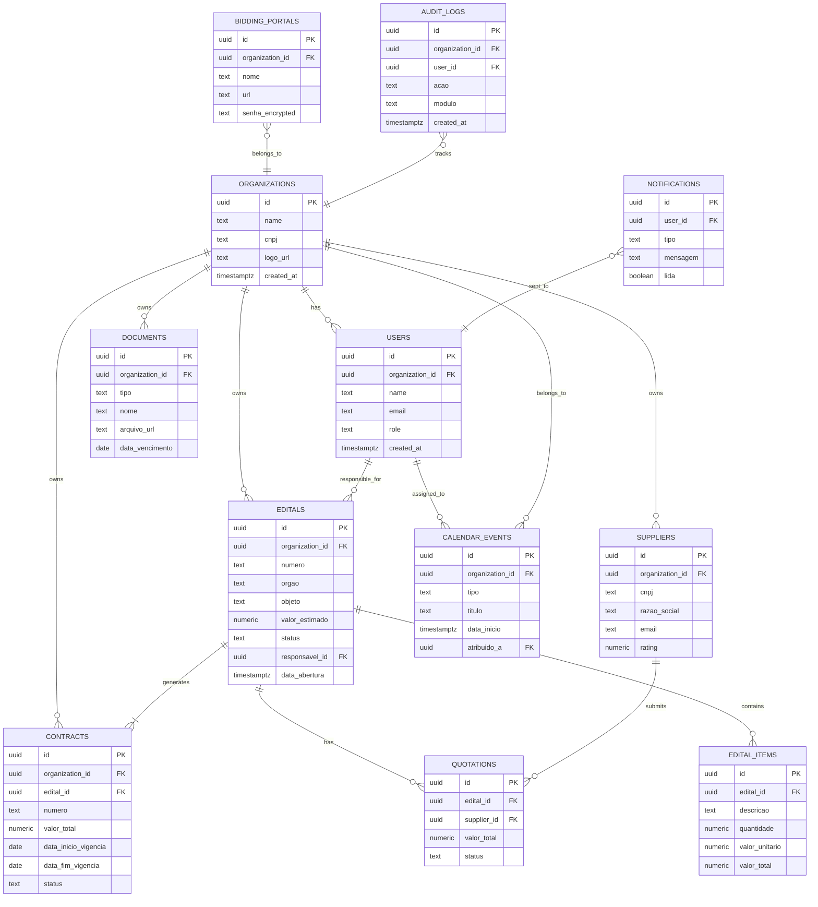

---

## 6. Fluxo de Autenticação

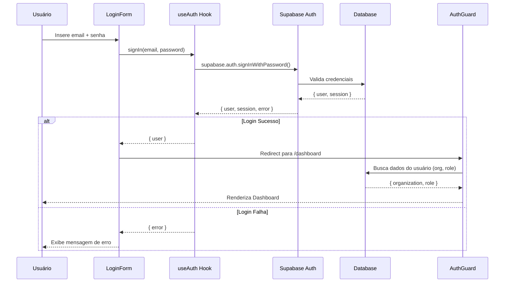

---

## 7. Fluxo de OCR de Editais

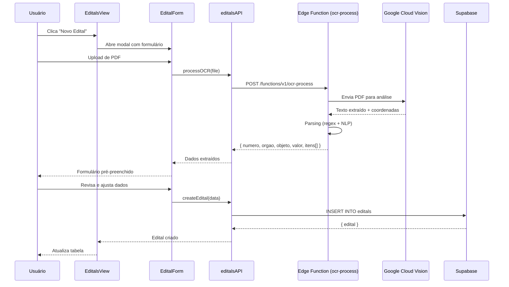

---

## 8. Pipeline de Deployment

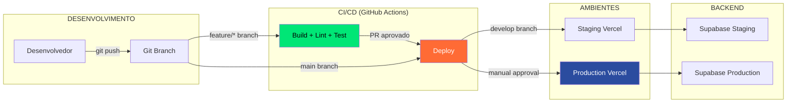

---

## 9. Roadmap de Desenvolvimento

```mermaid
gantt
    title LicitaFlow - Roadmap de Desenvolvimento (7 meses)
    dateFormat YYYY-MM-DD
    
    section Fase 0: Setup
    Setup e Fundação       :done, setup, 2025-11-01, 1w
    
    section Fase 1: MVP Core
    Sprint 1: Auth + Dashboard     :active, s1, 2025-11-08, 2w
    Sprint 2: Dashboard + Editais  :s2, after s1, 2w
    Sprint 3: OCR                  :crit, s3, after s2, 2w
    Sprint 4: Pipeline Kanban      :s4, after s3, 2w
    Sprint 5: Vault                :s5, after s4, 2w
    Sprint 6: Calendário           :s6, after s5, 2w
    
    section Fase 2: Avançado
    Sprint 7: Fornecedores         :s7, after s6, 2w
    Sprint 8: Cotações             :s8, after s7, 2w
    Sprint 9: Portais + Contratos  :s9, after s8, 2w
    Sprint 10: Análise Avançada    :s10, after s9, 2w
    
    section Fase 3: Integrações
    Sprint 11: Google APIs         :crit, s11, after s10, 2w
    Sprint 12: Apple + SMTP        :s12, after s11, 2w
    Sprint 13: BI e Relatórios     :crit, s13, after s12, 2w
    
    section Fase 4: Lançamento
    Sprint 14: Polimento + Launch  :milestone, s14, after s13, 2w
```

**Legenda:**
- 🔴 Vermelho (crit) = Sprints críticos
- ✅ Verde (done) = Concluído
- 🟦 Azul (active) = Em andamento

---

## 🎯 Fluxo de Uso - Caso de Uso Principal

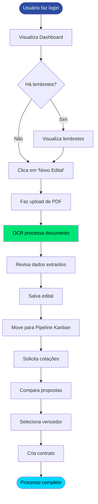

---

## 🔐 Fluxo de Segurança (RLS)

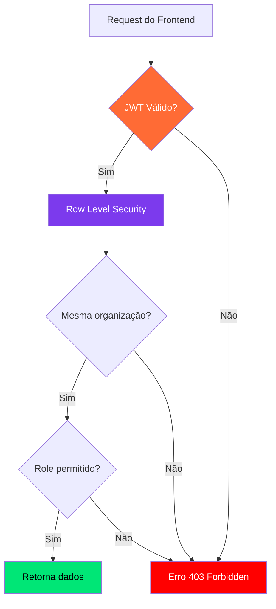

---

## 📊 Hierarquia de Permissões (RBAC)

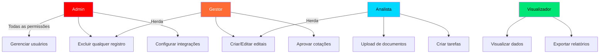

---

## 🎨 Estrutura de Tema (Claro/Escuro)

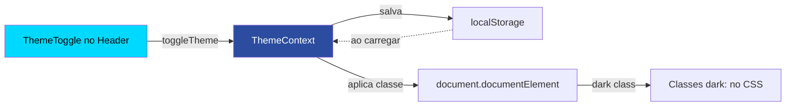

**Implementação:**
```javascript
// ThemeContext
const [theme, setTheme] = useState('light')

useEffect(() => {
  document.documentElement.classList.toggle('dark', theme === 'dark')
  localStorage.setItem('theme', theme)
}, [theme])
```

---

## 📦 Estrutura de Componentes Reutilizáveis

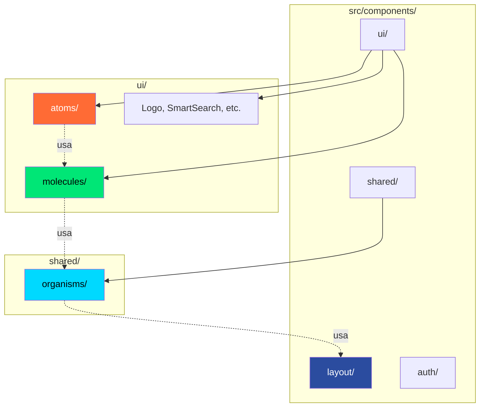

---

## 🔄 Ciclo de Vida de uma Feature

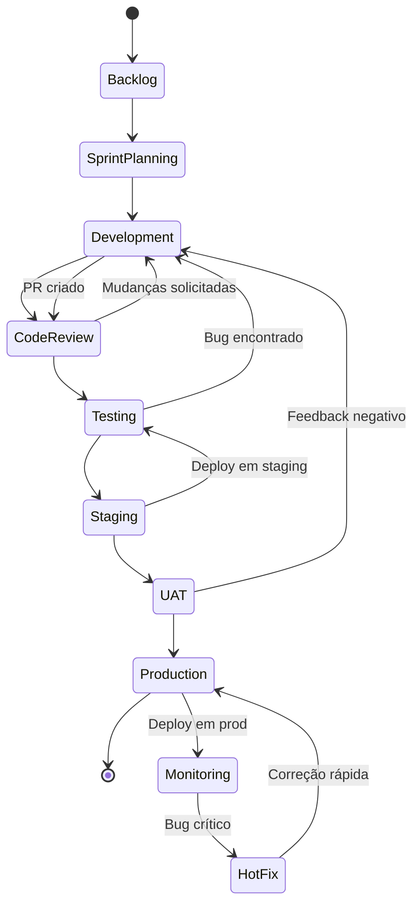

---

## 📈 Métricas de Performance

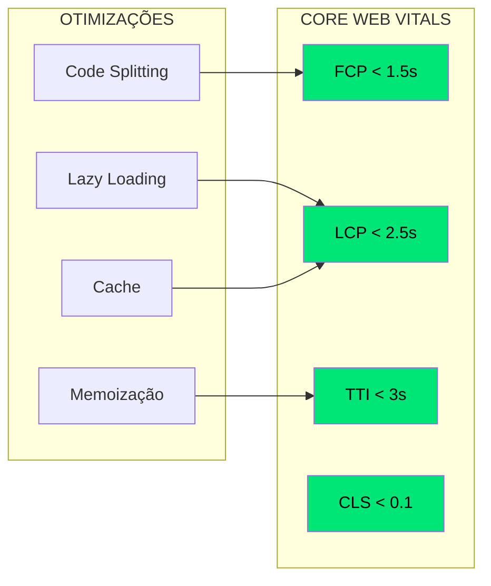

---

## 🗺️ Mapa de Navegação (Sitemap)

```mermaid
graph TD
    ROOT[/]
    LOGIN[/login]
    DASH[/dashboard]
    EDITALS[/editals]
    EDITAL_DETAIL[/editals/:id]
    PIPELINE[/pipeline]
    VAULT[/vault]
    CALENDAR[/calendar]
    SUPPLIERS[/suppliers]
    QUOTATIONS[/quotations]
    PORTALS[/portals]
    CONTRACTS[/contracts]
    REPORTS[/reports]
    SETTINGS[/settings]
    USERS[/users]

    ROOT --> LOGIN
    ROOT --> DASH
    DASH --> EDITALS
    DASH --> PIPELINE
    DASH --> VAULT
    DASH --> CALENDAR
    EDITALS --> EDITAL_DETAIL
    DASH --> SUPPLIERS
    DASH --> QUOTATIONS
    DASH --> PORTALS
    DASH --> CONTRACTS
    DASH --> REPORTS
    DASH --> SETTINGS
    SETTINGS --> USERS

    style DASH fill:#2B4C9F,color:#fff
    style EDITALS fill:#00D9FF,color:#000
    style PIPELINE fill:#00D9FF,color:#000
```

---

## 📌 Legenda de Cores (Consistente em Todos os Diagramas)

| Cor | Significado | Exemplo |
|-----|-------------|---------|
| 🔵 **Azul Royal** (`#2B4C9F`) | API Pública / Componentes Principais | APIs, Views |
| 🔴 **Vermelho** (`#FF6B35`) | Privado / Crítico / Hot | Services, Sprints críticas |
| 🟢 **Verde Tech** (`#00E676`) | Sucesso / Otimização / Átomos | Métricas positivas |
| 🟦 **Cyan** (`#00D9FF`) | Backend / Organismos / Info | Supabase, Organismos |
| 🟣 **Roxo Tech** (`#7C3AED`) | Views / Inovação | Views, Features avançadas |

---

**Última atualização:** 28 de Outubro de 2025  
**Versão:** 1.0

**Para visualizar os diagramas Mermaid:**
1. Use GitHub, GitLab ou Bitbucket (suporte nativo)
2. Use [Mermaid Live Editor](https://mermaid.live/)
3. Use extensões VSCode (Markdown Preview Mermaid Support)

---

**Documentação completa:** [README.md](./README.md)

